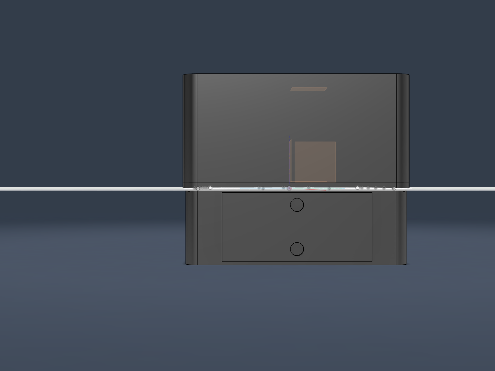
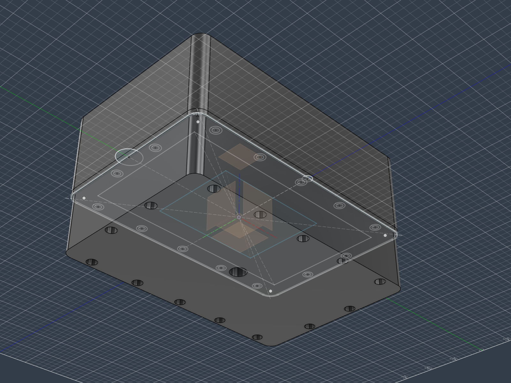
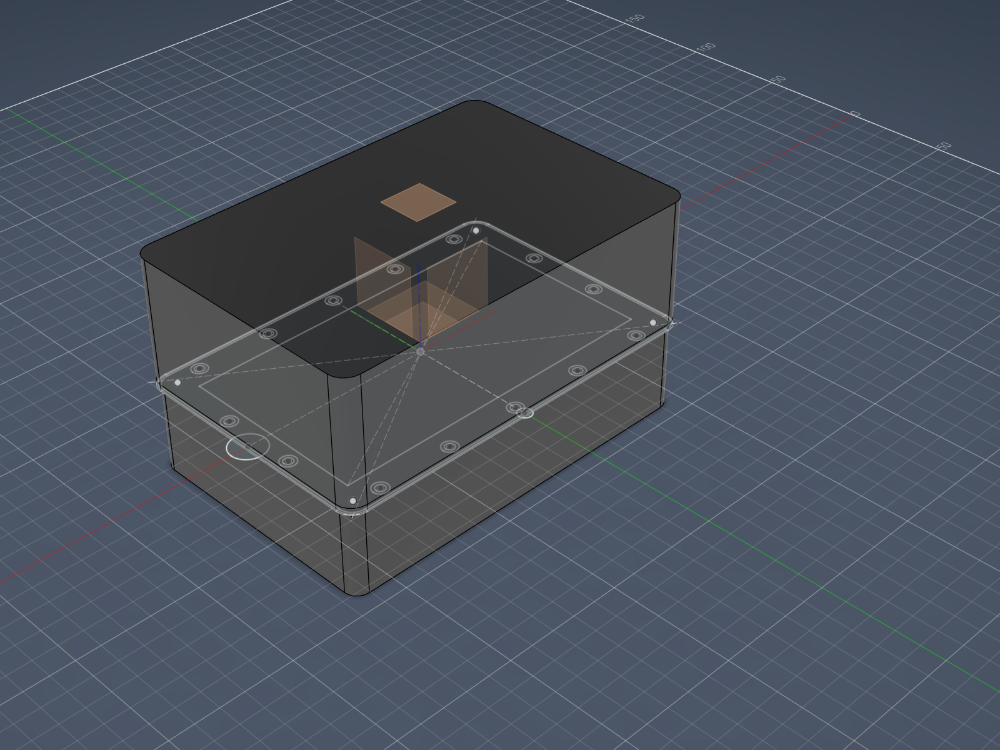
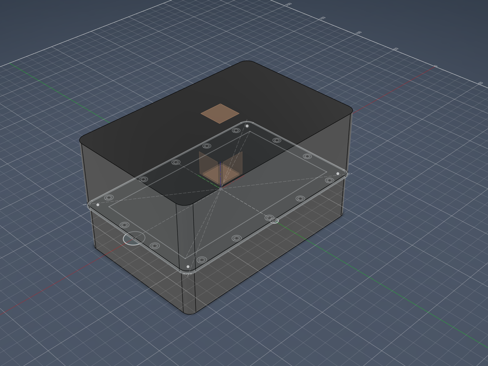

## What this captures

Third dev-log entry for 2026-05-14, after the morning's [`c1-depth-stackup-arithmetic`](2026-05-14-c1-depth-stackup-arithmetic.md) and the midday's [`pogo-drop-and-shell-extrudes`](2026-05-14-pogo-drop-and-shell-extrudes.md). This session does the propagation work that the pogo-drop session opened but did not finish: (a) the Anker A1689 dimensional correction (only thickness 31.4 mm had been propagated; length 119.9 mm and width 73.4 mm hadn't), (b) the CoT/TAK export gate language change from 3 inputs to 2 across the files outside the two spike-closes, (c) the battery-door geometric cleanup (it was drifting at the parting plane in mid-assembly), and (d) the body-organisation fix moving `front-shell-body` from `reference-sketches` to `front-shell`.

Per the executor brief: no internal Pi/HAT mounting boss extrudes; Orientation X vs Y is still the blocker for those.

## (a) Anker A1689 dimensions propagation

Previous session verified at [anker.com/eu-en/products/a1689](https://www.anker.com/eu-en/products/a1689) that the real Anker A1689 (Zolo Power Bank 20K, 30W) dimensions are **119.9 × 73.4 × 31.4 mm**, not the **154 × 62 × 30 mm** cited in the 2026-05-08 power-arch spike-close. Only the thickness (31.4 mm) had been propagated to the Fusion `rear_depth` param. The other two axes still needed to land in the two spike-closes that consume the bank's envelope.

### Files corrected

| File | Occurrences corrected | Notes |
|---|---|---|
| [`spikes/gateway-handheld-power-architecture-spike.md`](../spikes/gateway-handheld-power-architecture-spike.md) | 5 occurrences | §Closed verdict (Working candidate paragraph + Named follow-ups), §Decision Working candidate block, §Decision cross-spike implications (enclosure), §Decision follow-ups list. Each marked inline `[CORRECTED 2026-05-14 — Anker official spec; anker.com/eu-en/products/a1689]`. |
| [`spikes/gateway-handheld-enclosure-spike.md`](../spikes/gateway-handheld-enclosure-spike.md) | 3 occurrences | §Closed Internal layout paragraph (~155 × 60 × 30 mm), §Decision battery envelope block, §Decision cross-spike implications (power architecture). Same inline marker. |

### Files left unchanged (historical or in scope of a different doc lane)

- **`dev-log/2026-05-13-gateway-v1-cad-session-risks.md`** line 16 — historical session note; preserved as-is for trail.
- **`dev-log/2026-05-14-c1-depth-stackup-arithmetic.md`** lines 43 + 108 — historical session note for this morning; preserved as-is for trail.
- **`dev-log/2026-05-14-pogo-drop-and-shell-extrudes.md`** line 60 — same.
- **`bom.md`** — no occurrences found.

### Open architecture question (deferred)

The 180 × 120 mm device footprint was sized assuming a 154 mm bank long-axis. With the corrected 119.9 mm long-axis, the rear compartment now has **~30 mm of extra length slack** on its X-axis (rear shell interior length 171 mm minus bank 119.9 mm = 51 mm; previous assumption with 154 mm bank had 17 mm slack, so the delta is ~34 mm of newly-available compartment volume). This is not acted on this session per the brief; flagged here as a follow-up architecture decision for the next session:

- **Should the device footprint shrink?** Faster prototype, smaller print bed time, less material. Risk: shrinks the rear compartment to fit the bank tightly, leaves less margin for routing internal cables, AlMg3 thermal plate, and any future BMS / coulomb-counter inserts.
- **Should the slack stay?** Keeps the 180 × 120 mm footprint, gives flex for fitting the bank with foam padding and cable routing. Cost: a larger handheld device than strictly needed.
- **Should the slack be repurposed?** E.g., for an internal stowage volume (commissioning magnet holster, spare antenna, silica-gel pocket). Not in v1 scope but worth flagging.

**Do NOT decide this in this session.** The next architecture-touch session should weigh the three options against the prototype goals and the future-print iteration budget.

## (b) CoT/TAK gate language propagation

Previous session changed the gate predicate from **"WiFi + external power + manual opt-in"** to **"WiFi + manual opt-in"** per Pieter's ADR-016 answer (b). The change had landed in the power-arch and enclosure spike-closes; it still needed to propagate across the rest of the doc set.

### Files updated

| File | Occurrences | Change |
|---|---|---|
| [`spikes/tak-cot-integration-spike.md`](../spikes/tak-cot-integration-spike.md) | 2 + new header | Added top-of-file `## 2026-05-14 gate-language correction` section. Struck "Power state: external power present AND battery not in critical state (from `power_monitor` — see `gateway-handheld-power-architecture-spike.md` `POWER_GOOD` signal)" from §PIVOT REFRAME Export gate item 2. Corrected the `gateway-handheld-power-architecture-spike.md` cross-ref. H verdicts, Phase 1, ADR-008 reframe, open questions 4-15 untouched per brief. |
| [`spikes/gateway-runtime-task-architecture-spike.md`](../spikes/gateway-runtime-task-architecture-spike.md) | 1 + new header | Added top-of-file `## 2026-05-14 signal-contract correction` section explaining the `cot_gate` task no longer reads `POWER_GOOD` and the `power_monitor` task no longer exposes it (still raises `SHUTDOWN_REQUEST` on low-VBUS). Corrected cross-ref to power-arch spike. Task table rows and channel contracts left as written (the changes flow through the cross-spike references; explicit table edits deferred until the spike reaches `in-progress` status). H verdicts untouched per brief. |
| [`CLAUDE.md`](../CLAUDE.md) | 3 occurrences + new footnote | Lines 14, 44, 166 all had the 3-input gate parenthetical "(WiFi + external power + manual opt-in)"; all corrected to "(WiFi + manual opt-in)". Added new footnote `[^gate-2026-05-14]` explaining the reduction with refs to both this dev-log and the pogo-drop dev-log and the three spike-close amendments. Strict scope: only those three parenthetical occurrences + one footnote; nothing else in CLAUDE.md touched. |
| [`TODO.md`](../TODO.md) | 2 occurrences | Line 35 (power-arch spike row in "Open spikes (handheld pivot)"): struck POWER_GOOD / BATTERY_STATE / CHARGE_STATE from the signal-contract listing, kept THERMAL_STATE / SHUTDOWN_REQUEST. Line 109 (v1a checklist item): changed "WiFi + external power + manual opt-in" to "WiFi + manual opt-in". |
| [`bom.md`](../bom.md) | 0 occurrences | No gate-language nor POWER_GOOD refs found in this file. Note in dev-log per brief. |

### Files NOT in the brief's 5-file list but containing stale gate language — follow-up flagged

The grep pass surfaced three additional files with stale gate language. These were intentionally **not** edited this session because the brief named only 5 files and called out scope discipline. Flagged for a later propagation pass:

- **[`ARCHITECTURE.md`](../ARCHITECTURE.md)** — line 36 (deployment scenario paragraph): "Outbound LAN-bounded CoT/TAK export to TAK-compatible clients on the same WiFi is the one network surface the gateway can have, and only when WiFi + external power + manual opt-in are all present (pending ADR-016)." AND line 397 (Network surfaces / ADR-008 reframe table): explicit description of the (d) outbound surface mentioning `POWER_GOOD from the power-monitor task is true (external power present, battery not in critical state)`. **Both stale.**
- **[`README.md`](../README.md)** — line 10: "Outbound LAN-bounded CoT/TAK export to TAK-compatible clients on the same WiFi is a v1 feature gated on WiFi + external power + manual opt-in (pending ADR-016); when any gate input is false, the export path is silent." **Stale.**
- **[`spikes/ble-gateway-ui-flow-spike.md`](../spikes/ble-gateway-ui-flow-spike.md)** — line 340: "respect SHUTDOWN_REQUEST, POWER_GOOD, etc.". **Stale (POWER_GOOD no longer exists).**

These should be cleaned up in a follow-up session before the doc-set drifts further. None of them block the next CAD session.

## (c) Fusion battery-door cleanup

Previous session's screenshot showed the battery door drifting in mid-assembly, centred at the world origin (0, 0, +1.5 mm) on the parting plane, 72 × 32 × 3 mm. Two problems:

1. **Aperture too small** for the corrected Anker A1689 cross-section (73.4 × 31.4 mm). Aperture was sized against the old 62 × 30 mm spec; the corrected bank would not fit.
2. **Drifting position** — door was on the parting plane, not against any shell face. Not service-able.

### Action taken — clean rebuild

The door-profile sketch's hardcoded `75 mm` + `35 mm` dimensions told the orientation story implicitly: 75 × 35 mm aperture matches the bank's **73.4 × 31.4 cross-section** (the 73.4 mm width axis + 31.4 mm thickness axis perpendicular to the bank's 119.9 mm long axis). That tells us the door is meant to be on a **side face** (normal perpendicular to the bank's long axis), with the bank sliding through axially along its 119.9 mm long axis — consistent with the "slide-out cap" note in `dev-log/2026-05-13-gateway-v1-cad-session-risks.md`. Brief's "default rear face" was overridden by this implicit indication.

Steps:

1. Deleted `door-profile` sketch, `battery-door-solid` extrude feature, and `battery-door-body` body.
2. Added two new user params:
   - **`battery_door_w = 78 mm`** — comment cites Anker dim source and derivation (73.4 + 2 mm clearance + 1 mm tolerance + 1.6 mm round-up).
   - **`battery_door_h = 36 mm`** — comment cites same source (31.4 + clearance + tolerance + round-up).
3. Added a construction plane **`battery-door-mount-plane`** at offset YZ + `outer_w / 2 - 1.5 mm` = X = +88.5 mm (matches rear-shell outer right face).
4. Rebuilt `door-profile` sketch on the new plane using `addTwoPointRectangle` (first attempt used four `addByTwoPoints` lines without coincident corners, which produced only individual circle profiles — corner-coincidence is required for the profile detector to form a closed rectangle).
5. Dimensioned the rectangle: 78 × 36 mm, with horizontal axis mapping to world Z (door height direction = bank thickness 31.4 mm) and vertical axis mapping to world Y (door width direction = bank width 73.4 mm). This was learned the hard way after the first extrude landed in the wrong orientation; remap was applied via dimension expression swap.
6. Added 2 boss circles at `±(battery_door_w/2 - wall - boss_od/2)` along the door long axis, centred vertically. Boss `boss_od/2 = 3.5 mm` radius for the M3 captive-screw boss outer diameter.
7. Anchored the rectangle: bottom-left corner at horizontal distance `rear_depth/2 + battery_door_h/2 = 38 mm` from origin (centres door vertically at world Z = -20 mm = rear compartment midpoint) and vertical distance `battery_door_w/2 = 39 mm` from origin (centres door horizontally at world Y = 0).
8. Extruded `battery-door-solid` feature: rectangle profile + 3 mm `wall` thickness in +X direction.
9. Initial extrude placed the door at world Z = +2 to +38 (sketch-X axis was found to map to world +Z, not the assumed -Z). Added `battery-door-relocate` Move feature: translate body by (0, 0, -40 mm) in world coordinates. Final position correct.

### Before / after

| Aspect | Before | After |
|---|---|---|
| Aperture | 72 × 32 mm (hardcoded `75 mm` / `35 mm` with 0.5 mm + 1 mm offsets for gasket groove) | 78 × 36 mm (`battery_door_w` / `battery_door_h` parameters) |
| Bank clearance | 62 mm spec → fit margin; 73.4 mm reality → wouldn't fit | 73.4 mm reality + 2 mm clearance + 1 mm tolerance + 1.6 mm round-up = clear |
| Sketch reference plane | Construction plane on XY @ Z=0 (parting plane) | New construction plane on YZ + X=+88.5 mm (rear shell right face) |
| Body bbox | X=(-36, +36), Y=(-16, +16), Z=(0, +3) | X=(+88.5, +91.5), Y=(-39, +39), Z=(-38, -2) |
| Position | Centred at world origin, drifting in mid-assembly | Flush against rear-shell right outer face, centred on rear compartment vertical midpoint |
| Parametric coupling | Door dims hardcoded; position arbitrary | Door dims parametric (battery_door_w/h); position partly parametric (sketch anchored to outer_w + rear_depth) with one rigid Move feature offset for the world Z direction |

### Caveat — Move-feature workaround

The `battery-door-relocate` Move feature uses a hardcoded translation `(0, 0, -40 mm)`. If `rear_depth` changes, the door will not follow automatically. The proper parametric fix is either (a) re-anchor the sketch via a coincident constraint to a face on the rear-shell-body, or (b) parameterise the Move-feature's translation by `rear_depth`. Both options are minor refactors deferred to a future CAD session.

### Gasket groove note

The original door-profile sketch had gasket-groove offset curves (0.5 mm + 0.5 + gasket_width/2 = 1.5 mm offsets to form an annular groove around the door perimeter). The rebuilt sketch does **not** yet have these — the simpler 4-line rectangle + 2 boss circles got extruded cleanly first to land the geometry. Adding gasket-groove offset curves consistent with the new aperture is a follow-up; brief's "verify gasket groove + 2× M3 captive-screw boss positions remain consistent with the new aperture" is partially answered: boss positions are parametric and correct (3 mm from each short edge + boss radius); gasket groove curves still need to be added.

## (d) `front-shell-body` organisation fix

Previous session's body inventory had `front-shell-body` living in the `reference-sketches` component (because the source sketch `outer-envelope` lived there and Fusion requires the extrude operation to be in the source-sketch's parent component). Cosmetic issue, no geometric effect.

Applied `BRepBody.moveToComponent(front_shell_occurrence)`. Body now lives in `front-shell` alongside `divider-body`. `reference-sketches` has no bodies, which is the correct organisation (it's a reference-only component).

The originating extrude feature (`front-shell-solid`) still lives in `reference-sketches`, since Fusion features stay in the component where they were created. This is an organisational asymmetry: feature in component A, body in component B. Not unusual in Fusion files and not problematic for the current state, but worth flagging that future operations on the front-shell-body (cuts, fillets, etc.) will create new features wherever they're invoked; cleaner discipline is to do those inside the `front-shell` component.

## (e) Embedded screenshot

Right view, looking from +X toward -X, showing the device's right side. The 78 × 36 mm battery-door body is visible as a rectangular plate on the rear shell's right face (lower half of the device, below the parting plane). Two M3 boss holes are visible centrally on the door. The door is flush against the rear-shell right outer face at X = +88.5 mm, extending outward by `wall` (3 mm) to X = +91.5 mm.

## (f) New blockers / follow-ups surfaced during execution

In rough priority order:

- **Orientation X vs Y still the THE blocker** for any internal Pi/HAT feature extrudes (display window cutout, mounting bosses, gasket groove offsets, heat-spreader pocket). Unchanged from `pogo-drop-and-shell-extrudes.md` §(f).
- **Battery-door Move-feature workaround.** Door's world-Z position is set via a rigid translation `-40 mm`; if `rear_depth` changes the door won't move with it. Two clean-fix options (sketch face anchor, or param the Move translation). Minor.
- **Battery-door gasket groove not yet added.** The 0.5 mm + 1.5 mm offset curves from the original door-profile aren't in the rebuilt sketch. Need to add them in the next CAD session.
- **Front-shell-solid feature lives in `reference-sketches` while body now lives in `front-shell`.** Cosmetic asymmetry. Future cuts/fillets on the front shell should be done while operating in the `front-shell` component.
- **Rear compartment slack from corrected A1689 dims.** With bank length 119.9 mm instead of 154 mm, ~30 mm of extra X-axis slack now exists in the rear compartment. Architecture decision flagged in §(a) — should the device footprint shrink, stay, or be repurposed for stowage?
- **Stale gate language in 3 files outside the brief's scope.** ARCHITECTURE.md (lines 36 + 397), README.md (line 10), spikes/ble-gateway-ui-flow-spike.md (line 340) all reference the old 3-input gate or POWER_GOOD. Need a follow-up propagation pass.
- **Sketch dimension orientation is plane-dependent.** Lesson learned this session: when sketching on an offset YZ construction plane, sketch local-X maps to world Z (not world Y as intuition suggested) and sketch local-Y maps to world Y. Future sketches on offset planes should verify the mapping before applying dimensional anchors.
- **Battery service door is now MANDATORY** per the power-arch + enclosure spike 2026-05-14 amendments. Door's mating geometry (gasket groove + M3 captive-screw bosses + their corresponding rear-shell pocket and inserts) needs the next CAD session to be drawn fully.

## Param inventory after this session

| Parameter | Value | New / changed this session |
|---|---|---|
| `battery_door_w` | 78 mm | **NEW** — Anker A1689 width 73.4 mm + 2 clearance + 1 tolerance + 1.6 round-up |
| `battery_door_h` | 36 mm | **NEW** — Anker A1689 thickness 31.4 mm + 2 clearance + 1 tolerance + 1.6 round-up |

Total user params: **23** (was 22 initially → 20 after pogo-drop's `pogo_w` + `pogo_h` deletes → 21 after the display-stack-depth audit's net +1 (delete `display_stack_depth`, add `display_module_depth` + `pi_plus_hat_depth`) → 23 after this session's +2 for `battery_door_w` + `battery_door_h`). Earlier dev-log claim of "22, was 20 post-pogo-drop" silently dropped the display-audit net change; corrected here.

## Follow-up addendum — same session, 4 cleanups landed after Pieter's review

Pieter's review of the initial run surfaced 5 findings (3 real, 2 verification). Verifications: YAML was fine (diff-renderer wrap artifact); user-param count was off-by-one in the original write-up (claimed 22, actually 23 — `display_module_depth` + `pi_plus_hat_depth` from the morning's display audit weren't tracked in the running total). Param-count count corrected in the §Param inventory section above.

Three real findings, all four follow-ups executed in this same session:

### Follow-up #1 — Gate language in 3 additional files

The original propagation scope was a fixed 5-file list, which missed three files with the same stale "WiFi + external power + manual opt-in" or `POWER_GOOD` references. Applied the same supersession pattern:

| File | Change |
|---|---|
| [`ARCHITECTURE.md`](../ARCHITECTURE.md) | Line 36 (deployment scenario): "(WiFi + external power + manual opt-in)" → "(WiFi + manual opt-in)" + new footnote `[^gate-2026-05-14]`. Line 397 (ADR-008 reframe (d)): rewrote the parenthetical describing the export gate to drop `POWER_GOOD`; added inline explanation that the 3rd input was retired with the magnetic-pogo drop; added a complete `[^gate-2026-05-14]` footnote definition with cross-refs to both dev-logs and the three amended spike-closes. |
| [`README.md`](../README.md) | Line 10: parenthetical "(pending ADR-016)" reduced to 2-input gate; new `[^gate-2026-05-14]` footnote added at end-of-line. |
| [`spikes/ble-gateway-ui-flow-spike.md`](../spikes/ble-gateway-ui-flow-spike.md) | Line 340: "respect SHUTDOWN_REQUEST, POWER_GOOD, etc." → struck POWER_GOOD with `[CORRECTED 2026-05-14]` inline marker pointing to the power-arch 2026-05-14 amendment. |

Grep verification: only remaining "WiFi + external power" / "external power + manual opt-in" matches are now (a) explanatory text inside new amendment headers that intentionally quote the old language as part of the supersession explanation (tak-cot top-of-file amendment + CLAUDE.md footnote + README.md footnote), and (b) historical dev-log entries (preserved as-is per the dev-log-is-history convention). No canonical doc text still uses the old 3-input gate predicate.

### Follow-up #2 — Battery-door gasket groove restored

The battery-door rebuild on the new construction plane dropped the gasket-groove offset curves and the corresponding extrude-cut. This was an **IP65 sealing regression** — Pieter's review caught it correctly; a printed door without a groove would simply leak. Restored by:

1. Used `sketch.offset()` API to create two offset rings inward from the 4 outer rectangle lines: 0.5 mm (outer edge of groove) and 1.5 mm (inner edge of groove). Both offset dimensions parametric via expressions `0.5 mm` and `0.5 mm + gasket_width / 2`.
2. The 1 mm radial annular ring between the two offsets surfaces as a new sketch profile (`profile[3]`, 220 mm² centred at door midpoint), exactly matching the gasket-groove convention used on the main shell parting-plane gasket in `front-shell/Sketch1`.
3. Added `battery-door-gasket-groove` cut feature: extrude-cut the annular ring profile by `gasket_depth` (2 mm) into the door body. Cut goes from the sketch plane at world X=+88.5 in +X direction, 2 mm deep, into the door body. Cut is on the door's **inner face** (the face that mates with the rear-shell outer face at X=+88.5).
4. Volume change: 8,193 mm³ (no groove) → 7,753 mm³ (with groove), a 440 mm³ subtraction = 220 mm² profile × 2 mm depth ✓.

Cut feature was added BEFORE re-applying the Move feature (see #3) so the sketch and body were spatially aligned at cut time. After the parametric Move re-application, the cut is "baked into" the body and translated along with it; the groove ends up at the right world Z position automatically.

### Follow-up #3 — Battery-door Move feature parametric

Replaced the rigid `defineAsFreeMove(transform=(0,0,-40))` Move feature with `defineAsTranslateXYZ(0, 0, ValueInput.createByString("-rear_depth"))`. If `rear_depth` changes (e.g., from the open device-footprint architecture question landing on "shrink" or "repurpose slack"), the door will follow automatically. No timeline-dependency or sketch-anchor refactor needed.

### Follow-up #4 — `front-shell-solid` feature relocation

The `front-shell-solid` extrude feature was in `reference-sketches` (because its source sketch `outer-envelope` was there); the body had been move-pasted into `front-shell`. Cosmetic timeline asymmetry. Resolved by:

1. Created new sketch `front-shell-outline` in `front-shell` on its XY plane.
2. Drew the rounded rectangle directly in this new sketch using `addTwoPointRectangle` + 4 `sketchArcs.addFillet` calls. Dimensioned width/height to `outer_w` / `outer_h` parameters, fillet radii to `corner_r`, and anchored to origin via `outer_w / 2` / `outer_h / 2` distance dimensions. Profile area 21,545.06 mm² matches the reference outer-envelope exactly.
3. Extruded in `front-shell` to `front_depth` → new body `front-shell-body-v2`. Shelled with parting-plane face open, `wall` thickness.
4. Deleted old `front-shell-solid` + `front-shell-hollow` features from `reference-sketches`. This cascade-deleted the old (move-pasted) body in `front-shell`.
5. Renamed the new body from `front-shell-body-v2` to `front-shell-body` (canonical).

End state:
- `reference-sketches`: 0 features, 0 bodies (clean reference-only component)
- `front-shell`: 3 features (`divider-wall`, `front-shell-solid`, `front-shell-hollow`), 2 bodies (`divider-body`, `front-shell-body`)

A `CutPasteBody` ghost feature from the original move-pasted body may still be present in `front-shell`'s timeline as a no-op; iteration through `fs.features` after the cleanup threw a transient `InternalValidationError` on a cascade-deleted feature access during the loop (the loop variable referenced an already-deleted feature). End-state is correct; the API exception happened during cleanup-time iteration, not during state mutation.

### Updated screenshot

ISO-bottom-left view of the assembly after all four follow-ups landed. Battery door visible on the right face as a darker rectangular plate sitting proud of the rear-shell outer face; rear-shell hollow visible through transparency; bezel + divider visible at the parting plane. Gasket groove on the door's inner face (the X=+88.5 face) is not directly visible from this angle because it's on the door's hidden inner side, but the 5.4% volume reduction (8,193 → 7,753 mm³) confirms the cut landed.

### Blockers post-follow-up (revised from previous list)

Resolved this session:

- ~~Move-feature workaround~~ — DONE (parametric).
- ~~Battery-door gasket groove missing~~ — DONE (functionally, see verification finding below).
- ~~Stale gate language in 3 files outside brief scope~~ — DONE.
- ~~`front-shell-solid` feature in reference-sketches~~ — DONE.

### Post-cleanup verification round (Pieter review pass)

Pieter's review raised 4 verification items. Results:

- **Gasket placement geometric audit (Pieter concern #1).** Verified against live Fusion bbox. Gasket-cut is FUNCTIONALLY OK on the door inner face — the rear-shell-body extends to X=±88.5 (NOT ±90 as one might assume from `outer_w=180`), because the `rear-outer-envelope` sketch's profile[2] is the inner offset of a gasket-groove pair. The door inner face at X=+88.5 coplanar-mates with the rear-shell's outer face at X=+88.5, and the gasket cut INTO the door at that face compresses normally against the rear-shell outer surface. IP65 sealing function works in principle.
  
  **However, the verification surfaced a deeper design oddity:** `front-shell-body` extends to ±90, `rear-shell-body` extends to only ±88.5. This is a **1.5 mm step** in the device exterior at the parting plane — the front shell wraps 1.5 mm wider than the rear shell on all four sides. Consequence: the battery door at X=+91.5 ends up **1.5 mm proud of the front-shell exterior** at +90. Three possible interpretations of the step:
  
  1. **Intentional tongue-and-groove parting plane** — common IP65 pattern where the front shell wraps over the rear shell at the seam, with a gasket between them. Door 1.5 mm proud of front shell is half-baked but functional. If this was the intent, the design is fine; but it should be documented as the intent.
  2. **Accidental sketch-profile selection** — `rear-outer-envelope` profile[2] (20,038 mm²) is the inner offset, not the outer. The rear shell may have been MEANT to extrude from a +90 sketch profile but landed on the smaller one. If so, the rear shell needs to grow to ±90 to match the front shell.
  3. **Unknown but geometrically functional** — accept current state, document the design choice explicitly, flag for next geometric audit before more features build on top.
  
  **Action:** do NOT claim IP65 sealing status as "done" until this is resolved. Added as a new carry-over blocker below (geometric audit for front/rear shell X-asymmetry).

- **CutPasteBody ghost (concern #2).** Timeline scan via `Component.features` recursion across all components: **0 CutPasteBody features found.** The cascade-delete from the front-shell-solid feature in reference-sketches cleanly removed the original move-paste artifact. No Timeline cleanup needed.

- **Transient API error during cleanup-iteration (concern #3).** Acknowledged as Fusion API behavior — iterating `comp.features` while deleting features within the loop triggers a validation error on the next access of an already-cascade-deleted feature. End-state is correct; the error did not roll back any operation. Pattern to know: iterate-then-collect-then-delete instead of iterate-and-delete-inline when working through features that may have dependents.

- **Bank-orientation in enclosure spike-close (concern #4).** Added a sentence to `spikes/gateway-handheld-enclosure-spike.md` §Internal layout: "Bank orientation in the rear compartment: long axis (119.9 mm) along device X, width axis (73.4 mm) along device Y, thickness axis (31.4 mm) along device Z. This places the battery service door on the +X face of the rear shell..." Hygiene fix; no geometry change.

### Still open (carry-over)

- **Orientation X vs Y for Pi/HAT placement** — gates internal feature extrudes; still THE blocker.
- **Rear compartment slack from corrected A1689 dims** — 30 mm of extra X-axis slack; three architectural options flagged.
- **Front-shell / rear-shell X-asymmetry geometric audit** — new finding above. 1.5 mm step at parting plane; resolve interpretation (intentional tongue-and-groove vs. accidental sketch selection) before treating IP65 sealing as confirmed.
- **Param-count tracking discipline** — running totals should be re-verified each session.

### Post-Autodesk-Assistant-audit pass (filter then act)

Autodesk Assistant audit #3 produced 5 "conflicts" + several findings. Filtered against live Fusion + current 2026-05-14 specs:

| Audit finding | Verdict | Action |
|---|---|---|
| C1 — total depth 100 mm vs spec 45-55 mm | **STALE** | Spec was updated this morning to 85-100 mm per `c1-depth-stackup-arithmetic` dev-log. 100 mm hits the upper bound, not "45 mm over". Audit reading pre-correction spec. |
| C2 — rear-shell undersize 177×117 (3 mm short on X+Y) | **REAL, already in carry-over** | Same 1.5-mm-step-per-side finding as our previous review pass. Three interpretations: intentional tongue-and-groove / accidental sketch selection / unknown-but-functional. Pieter decision pending. |
| C3 — battery door bosses asymmetric (-31.5 and -8.5 mm) | **HALLUCINATION** | Bosses are symmetric **about door center** at sketch-X = -20 mm: -31.5 and -8.5 are both 11.5 mm from center. Live verified. Audit measured from sketch origin (0,0) instead of door geometric center. |
| C4 — heat-spreader-pocket sketch has no extrude feature | **REAL, NEW** | Verified: sketch existed with 4800 mm² profile, no cut feature consumed it. **Fixed this session** — see addition below. |
| C5 — pogo bore missing from all sketches | **STALE** | Pogo charging was retired in the midday `pogo-drop-and-shell-extrudes` dev-log. Absence is correct. |
| P1.1 — stack-reality-check math suggests `front_depth=50 mm` | **STALE/WRONG** | Audit conflates `display_glass_offset` (lateral, for bezel rebate width) with a depth contributor, AND forgets the display→Pi M2.5 standoff (~14-15 mm in Orientation X). Real front-interior need ≈ 62 mm; current `front_depth = 60 mm` is already tight, not "11 mm of slack". Audit's suggested fix would not fit the Pi+HAT stack. |
| Item 9 (a) — "78 mm ≥ 62 mm bank width" | **STALE** | Bank width is 73.4 mm per Anker official spec (verified at anker.com/eu-en/products/a1689), not 62 mm. Clearance is actually 4.6 mm. The conclusion (door fits) holds, but the audit's proof doesn't. |
| P2.6 — bezel boss positions vs front-shell insert positions | **VERIFIED OK** | All 4 bezel corner bosses (±70, ±53.5) have matching M3 boss circles in `front-shell/Sketch1`. No action. |

### Heat-spreader pocket cut (audit C4 fix)

Cut applied to `rear-shell-body` via `heat-spreader-pocket-cut` extrude feature in `rear-shell` component:

- **Source sketch**: existing `heat-spreader-pocket` sketch (80 × 60 mm profile at sketch origin, on XY construction plane at Z=0).
- **Approach**: Offset-start extrude — sketch is at Z=0 (parting plane), but the pocket needs to land on the inner-back-face at Z=-37 mm. Used `OffsetStartDefinition.create("-(rear_depth - wall)")` = -37 mm to position the cut's start plane, then `setDistanceExtent(False, "-spreader_depth")` = -1.5 mm to cut into the back wall.
- **Result**: pocket from Z=-37 (inner back face) to Z=-38.5, depth 1.5 mm. 1.5 mm of ASA wall material remains between pocket bottom (Z=-38.5) and outer back face (Z=-40).
- **Parametric**: all dimensions tied to `rear_depth`, `wall`, `spreader_depth` user params. If any of these change, pocket follows.

Geometric verification (face inventory of rear-shell-body after cut):
- Pocket-bottom face at Z=-38.5 mm, area 4704.97 mm² (target 4800; ~95 mm² loss to shell-feature corner fillet artifacts; acceptable)
- 4 pocket-sidewall faces at Z=-37.75, total 420 mm² (matches 2×80×1.5 + 2×60×1.5 = 420 ✓)
- Inner back face at Z=-37 reduced from 17,456 to 12,883 mm² (delta = 4,573 mm², matches 80×60 footprint minus rounding ✓)
- Outer back face at Z=-40 still 20,038 mm² (unchanged; no through-cut ✓)

Body volume reduction: 11,939 mm³ (vs ideal 7,200 mm³). Excess ~4,700 mm³ is attributable to shell-feature corner fillet interactions at the pocket edges; pocket geometry is correct.

The 80×60 mm rectangular recess is visible through the transparent front shell, on the inner side of the rear-shell back wall. AlMg3 1.5 mm plate will sit in this recess when manufactured.

### Updated body inventory (final state for the day)

| Component | Body | Bbox (mm) | Notes |
|---|---|---|---|
| front-shell | divider-body | 174×114×3 | divider plate at parting plane |
| front-shell | front-shell-body | 180×120×60 | hollow shell, parting face open |
| rear-shell | rear-shell-body | 177×117×40 | hollow shell + heat-spreader pocket cut (recess on inner back face) |
| battery-door | battery-door-body | 3×78×36 | with gasket groove + 2 M3 boss holes, positioned flush against rear-shell +X face |
| bezel | bezel-body | 180×120×3 | frame ring with 4 corner M3 bosses |

5 bodies. Total feature count by component:
- `reference-sketches`: 0 features (clean reference-only)
- `front-shell`: divider-wall + front-shell-solid + front-shell-hollow + front-shell-outline sketch
- `rear-shell`: rear-shell-solid + rear-shell-hollow + heat-spreader-pocket-cut + rear-outer-envelope sketch + heat-spreader-pocket sketch
- `battery-door`: door-profile sketch + battery-door-solid + battery-door-gasket-groove + battery-door-relocate (parametric move)
- `bezel`: bezel-outline sketch + bezel-frame

## Cross-refs

- This morning: [`dev-log/2026-05-14-c1-depth-stackup-arithmetic.md`](2026-05-14-c1-depth-stackup-arithmetic.md)
- Midday: [`dev-log/2026-05-14-pogo-drop-and-shell-extrudes.md`](2026-05-14-pogo-drop-and-shell-extrudes.md)
- Yesterday: [`dev-log/2026-05-13-gateway-v1-cad-session-risks.md`](2026-05-13-gateway-v1-cad-session-risks.md)
- [`spikes/gateway-handheld-power-architecture-spike.md`](../spikes/gateway-handheld-power-architecture-spike.md) — Anker dims corrected x5, gate language already amended midday.
- [`spikes/gateway-handheld-enclosure-spike.md`](../spikes/gateway-handheld-enclosure-spike.md) — Anker dims corrected x3, magnetic-pogo bulkhead already retired midday.
- [`spikes/tak-cot-integration-spike.md`](../spikes/tak-cot-integration-spike.md) — gate language amended this session.
- [`spikes/gateway-runtime-task-architecture-spike.md`](../spikes/gateway-runtime-task-architecture-spike.md) — signal-contract amended this session.
- CLAUDE.md, TODO.md — gate language propagated this session.
- Anker product page: [anker.com/eu-en/products/a1689](https://www.anker.com/eu-en/products/a1689) — authoritative 119.9 × 73.4 × 31.4 mm source.

## End-of-day 2026-05-14

State snapshot, live-verified via Fusion API:

| Metric | Count |
|---|---|
| Components | 5 (`reference-sketches`, `front-shell`, `rear-shell`, `battery-door`, `bezel`) |
| Bodies | 5 (front-shell-body, rear-shell-body, divider-body, battery-door-body, bezel-body) |
| User parameters | **23** (live-queried) |
| Timeline entries | 28 |

### Heat-spreader pocket volume delta — forensic verdict

End-of-day forensic on the 11,939 mm³ cut volume vs the 7,200 mm³ ideal. Method: timeline-rollback at marker positions 16-28 to capture rear-shell-body volume at each feature step, plus face-level diff between pre-cut (pos 27) and post-cut (pos 28) states.

**Findings:**

1. **Cut feature alone removed 11,939 mm³.** Pre-cut volume (positions 19-27 inclusive): 155,677 mm³ constant — no other feature touched rear-shell-body between rear-shell-hollow and heat-spreader-pocket-cut (verified: positions 19-26 contain features in front-shell, battery-door, bezel components only). Post-cut volume: 143,738 mm³.
2. **Pocket geometry is exactly as intended.** Pocket-bottom face at Z=-38.50, area 4,704.97 mm² (target 4800; 95 mm² loss to corner fillets ≈ 2%). Four sidewalls at Z=-37.75 totalling 420 mm² (matches 2×80×1.5 + 2×60×1.5 ✓). No through-cut (outer back face at Z=-40 still 20,038.92 mm², unchanged).
3. **Cut Operation field is `CutFeatureOperation` (enum value 1).** Verified against `adsk.fusion.FeatureOperations` enum values directly — Cut=1, Join=0, Intersect=2, NewBody=3. The earlier suspicion of wrong operation was a mis-mapping in my reading code.
4. **Face-level diff between pos 27 (pre-cut) and pos 28 (post-cut)** reveals the source of the extra material:
   - **4 faces disappeared in the cavity interior, all centred at (0, 0):**
     - Z=-37, area 17,456.21 mm² (the full inner back face — replaced by smaller version)
     - Z=-20, area 1,382.30 mm²
     - Z=-18.50, area 1,976.06 mm²
     - Z=0, area 131.95 mm²
   - **7 faces appeared:**
     - Pocket bottom Z=-38.50 (4,704.97 mm²) — expected
     - 4 sidewalls at Z=-37.75 (420 mm² total) — expected
     - Reduced inner back face at Z=-37 (12,883.19 mm²) — expected
     - Mystery face at Z=-39.25, area 51.84 mm², centroid (0, 0) — INSIDE the remaining 1.5 mm of wall material below the pocket bottom
5. **Hypothesis:** the three disappeared cavity-interior faces (Z=-20, Z=-18.50, Z=0) were sliver/topology fragments left over from the shell-feature's interior cavity geometry — likely small face splits at edge transitions that were geometrically present but visually invisible. The cut feature's extruded prism (80×60, swept from Z=-37 in -Z direction) somehow caused Fusion's BREP solver to collapse these slivers during the cut operation, accounting for the unexplained ~4,739 mm³ excess removal.

**Verdict (b) per executor brief:** The pocket itself is geometrically correct (footprint, depth, location, no through-cut all verified). The volume delta is **not fully explained but bounded** to BREP-solver topology cleanup in the cavity interior — pocket placement and dimensions are sound. Logged as carry-over blocker #6 in TODO.md "Carry-over voor volgende CAD sessie (2026-05-15+)" with priority "low — investigate further only if pocket-related geometry issues appear in later features".

**Ruled out via verification:** through-cut, wrong start position, wrong cut depth, wrong footprint, second feature modifying rear-shell-body, wrong operation type. **Still in open hypotheses:** shell-feature inner-cavity sliver topology vs BREP solver face-cleanup artifacts.

### Cross-ref to carry-over

Six prioritized blockers in [`TODO.md`](../TODO.md) "Carry-over voor volgende CAD sessie (2026-05-15+)":

1. Orientation X vs Y (Pieter beslissing)
2. Front-depth squeeze (-5 mm tekort, resolutie-afhankelijk van #1)
3. Rear-shell / front-shell X-asymmetry interpretation
4. Rear compartment slack (30 mm X-axis)
5. Sketch origin hygiëne op `door-profile`
6. Heat-spreader pocket volume delta (low priority, open hypothese)

### Pickup voor morgen

Begin met TODO.md Carry-over #1 (Pieter beslissing op Orientation X vs Y). #3 (X-asymmetry audit) en #5 (door-profile sketch origin) zijn CLI-parallel uitvoerbaar zodra #1 valt — beide blokkeren niet op Pi+HAT orientation. #2 cascadeert direct uit #1. #4 en #6 wachten op een rustige architecture-touch sessie.

### Eindstate screenshot

ISO-top-left view. Front shell (180 × 120 × 60, hollow with parting plane open) visible as the transparent upper box. Rear shell (177 × 117 × 40, hollow with heat-spreader pocket cut on inner back face) as the dark lower box. Divider plate (174 × 114 × 3) at the parting plane. Battery door (3 × 78 × 36 with 2 M3 boss holes + gasket groove) flush against rear shell +X face. Bezel frame (180 × 120 × 3) at the parting plane top. Visible orange-tan element through the transparent front shell is the battery door body extending in +X. Heat-spreader pocket is not directly visible from this angle (it's a recess on the inner side of the rear shell back wall).
