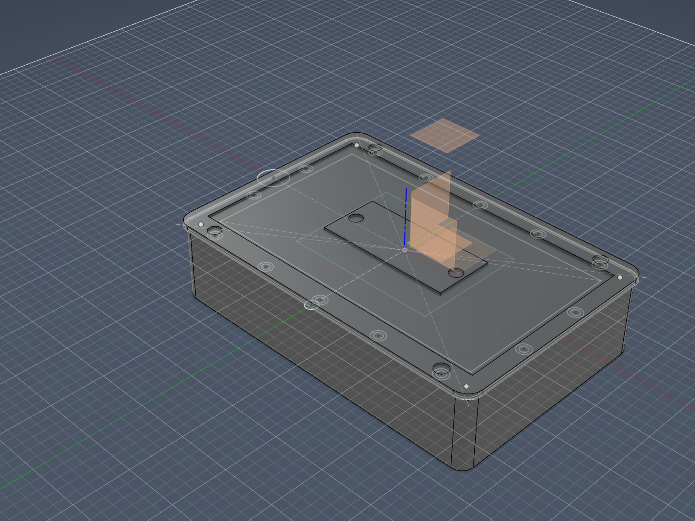

## What this captures

Session that (a) retires the magnetic-pogo charging connector from the v1 gateway, (b) re-scopes the CoT/TAK export gate language because the `POWER_GOOD` signal disappears with pogo, (c) applies the long-promised depth-parameter correction to Fusion 360 with cited datasheet numbers, (d) lands the first solid 3D extrudes of the five shell components so Pieter can see something other than a flat sketch in Fusion. Earlier in the day, [`dev-log/2026-05-14-c1-depth-stackup-arithmetic.md`](2026-05-14-c1-depth-stackup-arithmetic.md) did the per-layer stack-up math and corrected the enclosure spike's depth target from "~45–55 mm" to "~85–100 mm"; this session consumes that arithmetic.

## (a) Decision: drop magnetic-pogo charging from v1

Pieter's call this session: **no external charging input in the enclosure wall at all.** Recharging is fully external — open the battery service door, remove the Anker A1689 power bank, charge it on the bench via its own integrated USB-C cable to any wall adapter, return it, close the door.

What this saves:

- One IP65 sealing surface (the magnetic-pogo bulkhead).
- One daily-cycled connector wear surface.
- One BOM accessory category (magnetic charge cable + spare).
- The `POWER_GOOD` signal disappears from the firmware contract — no external charger presence to detect.
- The `BATTERY_STATE` / `CHARGE_STATE` signals were already declared non-firmware-readable in the 2026-05-08 power-arch spike-close (commercial banks expose neither over a usable interface); the amendment drops them from the firmware signal surface entirely.

What this trades:

- The device cannot run while the bank is being charged in v1 (no pass-through). Operationally this matches the SARCOM use case — shift-change swap, not run-while-charging — and the 2026-05-08 spike-close's "hot-swap not supported" + "operationally acceptable" reasoning carries over.

## (b) Pieter's written answer to the ADR-016 CoT/TAK gate question

With `POWER_GOOD` gone, the CLAUDE.md working language **"WiFi + external power + manual opt-in"** is broken. The session HALTed and asked Pieter to pick the new wording. Recorded answer:

> **(b) WiFi + manual opt-in only.**
>
> Two inputs, not three. The "external power" input is gone. CoT/TAK is allowed to emit on near-empty battery; clean shutdown on low-VBUS catches the consequence at the file-system level (SQLite WAL durability + read-only rootfs partition layout, per power-arch spike `Clean-shutdown approach` (a)+(c)). The pending ADR-016 wording uses this language.

The other two options not chosen:

- (a) WiFi + battery-state above threshold + manual opt-in — rejected because BATTERY_STATE is not exposed by the commercial bank, so the threshold check would require a coulomb counter on the output line or VBUS-divider analytics; not worth the firmware complexity.
- (c) Drop CoT/TAK from v1 entirely — rejected; CoT/TAK export is a working v1 capability per the [`spikes/tak-cot-integration-spike.md`](../spikes/tak-cot-integration-spike.md) lane and stays scoped.

## (c) Spike-close updates applied

Both spike-closes get a top-of-file dated supersession section + inline edits in §Closed and §Decision. Historical text preserved; struck clauses marked `[SUPERSEDED 2026-05-14]`.

- [`spikes/gateway-handheld-power-architecture-spike.md`](../spikes/gateway-handheld-power-architecture-spike.md) — **2026-05-14 partial supersession — magnetic-pogo charging retired**. New §Decision amendment block at top of decision-note code-block lists clause-level changes. `POWER_GOOD` removed from signal contract; `BATTERY_STATE` / `CHARGE_STATE` removed from firmware surface (operator-LED visible only); `SHUTDOWN_REQUEST` survives unchanged. Charging-input block rewritten to "external only". Service block: battery service door promoted from optional to MANDATORY (only regular access path). `peak-while-charging` operating-envelope caveat retired. Tak-cot-integration cross-spike line updated to the (b) gate language.
- [`spikes/gateway-handheld-enclosure-spike.md`](../spikes/gateway-handheld-enclosure-spike.md) — **2026-05-14 partial supersession — magnetic-pogo charging bulkhead retired**. Bulkhead inventory: magnetic-pogo entry removed (was 1× mandatory in 2026-05-08 verdict; now 0). Battery service door promoted to mandatory in same inventory. §Decision USB-C charging subsection rewritten to "no in-shell charging path in v1". Earlier today's depth-spec correction (45–55 mm → 85–100 mm) is unchanged by this amendment.

## (d) Fusion 360 changes applied

### User parameters — before / after

| Parameter | Before | After | Note |
|---|---|---|---|
| `pogo_w` | `25 mm` | **deleted** | magnetic-pogo retired |
| `pogo_h` | `15 mm` | **deleted** | magnetic-pogo retired |
| `display_stack_depth` | `30 mm` (comment: "display + driver + ribbon stack") | **deleted, renamed** | misleading param — 30 mm was a hand-wave; real numbers are 15 mm for the display module and 25-26 mm for Pi+HAT above the Pi PCB, those are separate concerns |
| `display_module_depth` | — | **added: `15 mm`** | Pi Touch Display 2 (7") module thickness per RPi product brief https://datasheets.raspberrypi.com/display/touch-display-2-product-brief.pdf and docs https://www.raspberrypi.com/documentation/accessories/touch-display-2.html |
| `pi_plus_hat_depth` | — | **added: `27 mm`** | Pi 5 PCB (1.6 mm) + Dragino LoRa GPS HAT envelope (25 mm per https://www.dragino.com/downloads/downloads/LoRa-GPS-HAT/LoRa_GPS_HAT_UserManual_v1.0.pdf §1.8) + 0.4 mm clearance |
| `front_depth` | `40 mm` | `60 mm` | grown per stack-up math: 3 wall + 3 window + 0 air + 15 display + ~14 standoff (Orientation X clears Pi 5 bottom-side USB-A/RJ45) + 27 pi_plus_hat + ~1 clearance + ~1.5 divider half ≈ 64 mm, rounded to 60 (squeezes 4 mm of slack to stay within 85-100 mm spec) |
| `rear_depth` | `35 mm` | `40 mm` | grown per Anker A1689 thickness verified on official EU product page https://www.anker.com/eu-en/products/a1689 — **31.4 mm actual** (not the 154×62×30 mm cited in 2026-05-08 power-arch spike-close; Anker is authoritative). Stack: 1.5 divider half + 1 clearance + 31.4 battery + 1 clearance + 1.5 AlMg3 sheet + 3 rear wall ≈ 39.4 mm, rounded to 40 |

**Total external depth = 60 + 40 = 100 mm.** Upper edge of the corrected ~85–100 mm spec range; arithmetic actually wants ~102 mm if all hand-wave clearances are kept generous, so 100 mm represents the squeezed-to-spec landing. Orientation X is assumed for the standoff budget; Orientation Y would change this significantly and is still open (see blockers below).

Final user-parameter count: 20 (was 22 — three deletes, two adds).

### Sketch1 cleanup

The pogo cutout rectangle (4 lines at x ∈ [-12.5, +12.5], y ∈ [-60, -45] mm) was removed from `front-shell/Sketch1`. Cascaded constraint and dimension deletion:

| Metric | Before | After | Δ |
|---|---|---|---|
| Curves | 69 | 65 | -4 (rectangle lines) |
| Dimensions | 46 | 42 | -4 (pogo_w, pogo_h, pogo_w/2 + the 4th from automatic clean-up) |
| Constraints | 64 | 60 | -4 |
| Profiles | 49 | 44 | -5 (rectangle profile + 4 internal sub-profiles around it) |

Grep across all sketches confirmed zero remaining `pogo` references after the delete.

### Solid extrudes — five bodies

First 3D pass. Each body extruded with `Operation: NewBody`; bounding boxes verified against expected dimensions:

| Body | Component | Source sketch / profile | Extent | Bounding box (mm) | Volume (mm³) | Notes |
|---|---|---|---|---|---|---|
| `front-shell-body` | `reference-sketches` (org cleanup deferred) | `outer-envelope` profile[0] (21,545 mm²) | `+front_depth` (60 mm) | 180 × 120 × 60 | 163,275 (post-shell) | Shell feature applied: parting-plane face open, `wall` (3 mm) thickness |
| `rear-shell-body` | `rear-shell` | `rear-outer-envelope` profile[2] (20,038 mm² — inner of gasket offset) | `-rear_depth` (-40 mm) | 177 × 117 × 40 | 155,677 (post-shell) | Shell feature applied: parting-plane face open, `wall` (3 mm) thickness |
| `divider-body` | `front-shell` | `divider-horizontal` profile[0] (19,722 mm²) | symmetric `wall` (3 mm total, 1.5 mm each side of parting plane) | 174 × 114 × 3 | 59,169 | Symmetric extent corrected after first attempt landed 1.5 mm by `isFullLength=True` semantics misread |
| `battery-door-body` | `battery-door` | `door-profile` profile[2] (2,227 mm²) | `wall` (3 mm) | 72 × 32 × 3 | 6,681 | Door is positioned per its sketch; geometric placement against the rear shell wall is still unresolved (see blockers) |
| `bezel-body` | `bezel` | `bezel-outline` profile[0] (5,743 mm² frame ring) | `wall` (3 mm) | 180 × 120 × 3 | 17,229 | Frame ring only — display window opening still present |

The front-shell-body landed organisationally in the `reference-sketches` component because that's where the `outer-envelope` source sketch lives and Fusion requires the extrude operation to be performed in the source-sketch's parent component. Cleanup task: move the body into the `front-shell` component (or duplicate the outer-envelope sketch into `front-shell`).

### (e) Embedded screenshot — ISO-top-right after extrudes

What's visible: hollow front shell with parting-plane face open (looking down into the cavity from the iso-top-right angle), divider plate at parting plane with the central USB-C pass-through hole, rear shell extending below (hidden by perspective), bezel frame at the parting plane, and the battery-door-body floating in the middle of the assembly (not yet positioned against the rear shell wall — see blockers). Wall thickness 3 mm visible. Screen-shot output via `viewport.saveAsImageFile(...)` directly because the `fusion_screenshot` MCP wrapper is broken against Fusion 2702.x (known issue, captured in [`dev-log/2026-05-13-gateway-v1-cad-session-risks.md`](2026-05-13-gateway-v1-cad-session-risks.md) §Process / tooling caveats).

## (f) What blocks the next CAD session

In rough priority order, each one a real unknown that needs an answer before further extrudes can land safely:

- **Orientation X vs Y still open** (per `dev-log/2026-05-14-c1-depth-stackup-arithmetic.md` §Layout / orientation uncertainty). The current shell extrudes used Orientation X assumptions for the standoff budget (Pi 5 bottom-side facing the display, ~14-15 mm standoff to clear USB-A/RJ45). Orientation Y would relocate the Dragino HAT off the back of the display (40-pin ribbon to a side-mounted HAT) and change the entire internal layout. **This is THE blocker for internal Pi/HAT mounting boss extrudes.**
- **Battery-door geometric placement.** The door body is currently extruded at its sketch's drawn position, which floats in the middle of the assembly rather than seating against the rear shell wall. Either the door-profile sketch needs to move to the correct face of the rear shell, or the door needs to be re-anchored via Joint constraints, or both. Decision deferred.
- **Battery-door aperture sizing against verified A1689 dimensions.** Door is currently 72 × 32 mm (≈ 2,227 mm² profile). With the corrected A1689 cross-section of 73.4 × 31.4 mm (was 62 × 30 mm in the spike-close that the door was sized against), the aperture is too tight on the long axis (73.4 > 72) and just barely clears on the short axis (31.4 < 32 with ~0.3 mm each side). Door needs to grow to ~78 × 36 mm to give 2-3 mm service clearance on each axis.
- **Body organisation cleanup.** `front-shell-body` currently lives in the `reference-sketches` component instead of `front-shell`. Either move via "Move Body" or duplicate the source sketch into front-shell and re-extrude there.
- **Heat-path geometric resolution (C1.4 from earlier dev-log).** The AlMg3 sheet is specified in the rear-shell pocket but the SoC heat-spreader block lives in the front compartment. The thermal column crossing the divider is still not modelled in CAD — either the divider needs a cut-out for the thermal column or the AlMg3 plate moves to the front-compartment back wall.
- **Sub-finding from today's depth math.** The honest stack-up arithmetic puts total external depth at ~102-105 mm if all clearances stay generous. Today's params (60 + 40 = 100 mm) squeeze that to fit the spike-close ~85-100 mm target. If extrudes surface assembly issues that need more clearance, the spike-close target may need to grow to ~100-105 mm. Watch for this in the next session.
- **Internal Pi/HAT mounting bosses, Sketch1's existing 8 bosses around the perimeter, and the gasket groove offsets** are all sketched but not extruded yet. Each waits on a resolved orientation decision before extrude.
- **Sketch1's display window opening as a through-cut in the front shell** is not yet performed. Currently the front-shell-body is a closed (shelled) box with no display window cutout — the bezel ring is a separate body floating on top.

## Cross-refs

- Today's morning entry: [`dev-log/2026-05-14-c1-depth-stackup-arithmetic.md`](2026-05-14-c1-depth-stackup-arithmetic.md) — the stack-up math this session consumes.
- Yesterday's CAD session: [`dev-log/2026-05-13-gateway-v1-cad-session-risks.md`](2026-05-13-gateway-v1-cad-session-risks.md) — the risk register; C1, B3, and the shallow-spike-close warnings all touched here.
- [`spikes/gateway-handheld-power-architecture-spike.md`](../spikes/gateway-handheld-power-architecture-spike.md) — 2026-05-14 partial supersession landed.
- [`spikes/gateway-handheld-enclosure-spike.md`](../spikes/gateway-handheld-enclosure-spike.md) — 2026-05-14 partial supersession landed.
- `bom.md` — magnetic-pogo cable accessories noted as retired in §Explicitly NOT ordering.
- CLAUDE.md "Do NOT re-open" list — unchanged. ADRs 001-014 untouched. Pending ADR-015/016/017 still pending; CoT/TAK gate language for the eventual ADR-016 write is now "WiFi + manual opt-in only".
